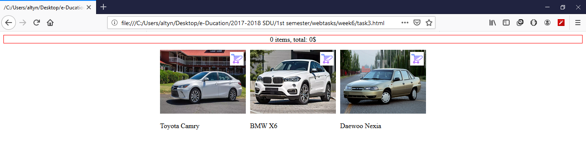

# About repository
This repository is for <a href="https://github.com/ardakshalkar/foundationsofweb2017tasks">assignments</a> that were done in course of web programming

<a href="https://docs.google.com/document/d/1qi5RJ2OnRJGZ2o3u5SCoEVD7EtSnKRjFsFG8Z1Amb-I/edit">Task1</a>
<a href="https://docs.google.com/document/d/1kzwqaMFQrLax9_z_8iRyNlxuvOVPdyK_5jQMStzcNC8/edit">Task 2</a>
<a href="https://docs.google.com/document/d/1JWyWJEegQ_F8qkQdXQY9A-3AT8DtWlZEVjhKHlpQyZ8/edit">Task 3</a>
<a href="https://docs.google.com/document/d/130WWQIEsCb-aIp45_GNaurCsEF0sitg7etTXQ9XUrrU/edit">Task 4</a>
<a href="https://docs.google.com/document/d/1zD6180dT4WJ4c_DymDea4YhMZBKO_J9zpJ5oha_nUVg/edit">Task 5</a>
<a href="https://docs.google.com/document/d/1YadPxHrHjF9qPhAj4ObqB1KUZphF5qlN2byT4re3ZOc/edit">Task 6</a>

# About course
The lessons were held by these <a href="http://web.stanford.edu/class/cs193x/lectures/">lectures</a> of <a href="http://web.stanford.edu/class/cs193x/staff/">Victoria Kirst</a>

The images of the completed tasks are shown below:

#### Week 1

#### Week 2

#### Week 3

#### Week 4

#### Week 5

#### Week 6

#### Week 7

#### Week 8

#### Week 9

#### Week 10

#### Week 11

